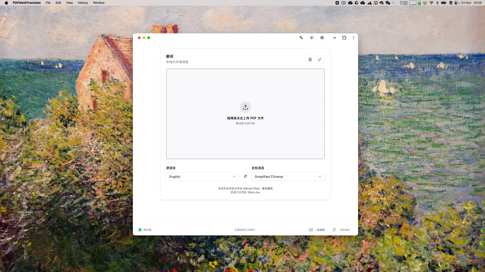
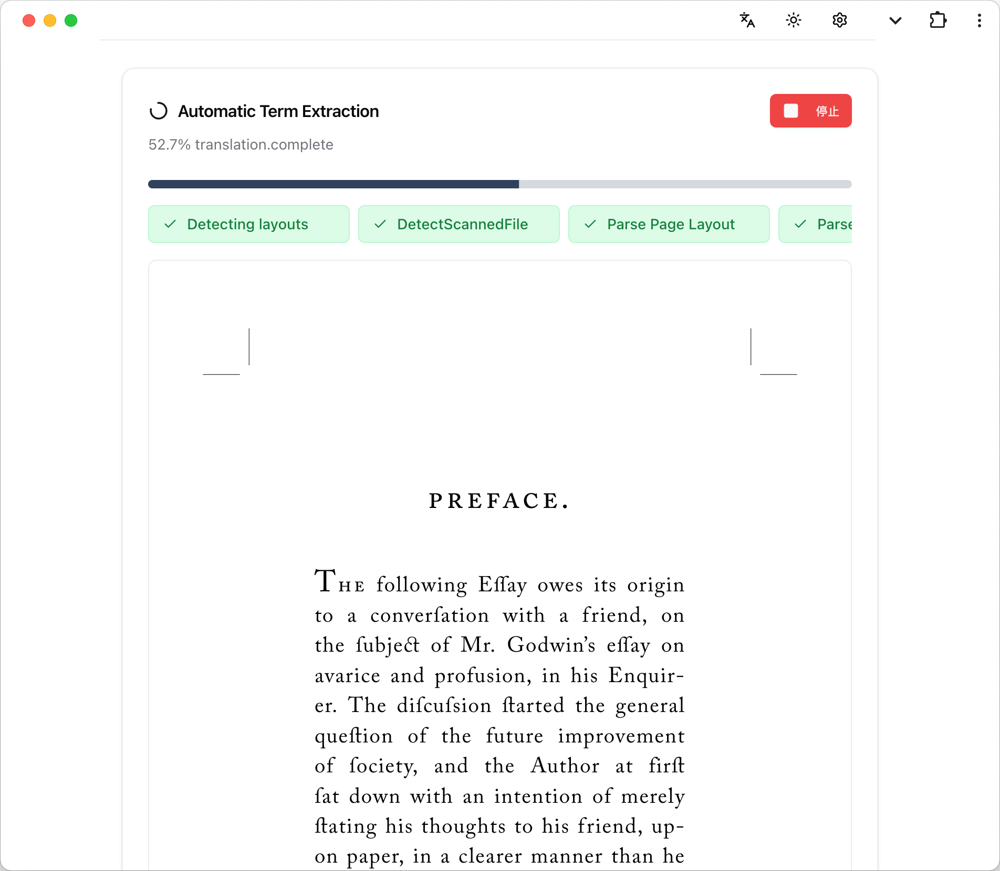
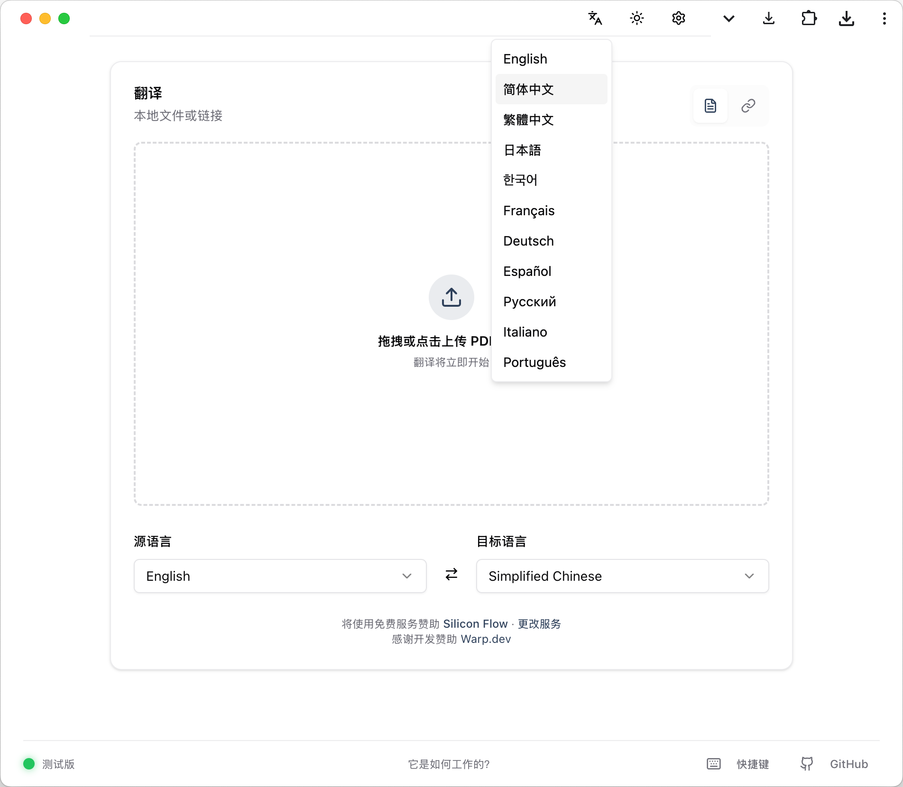
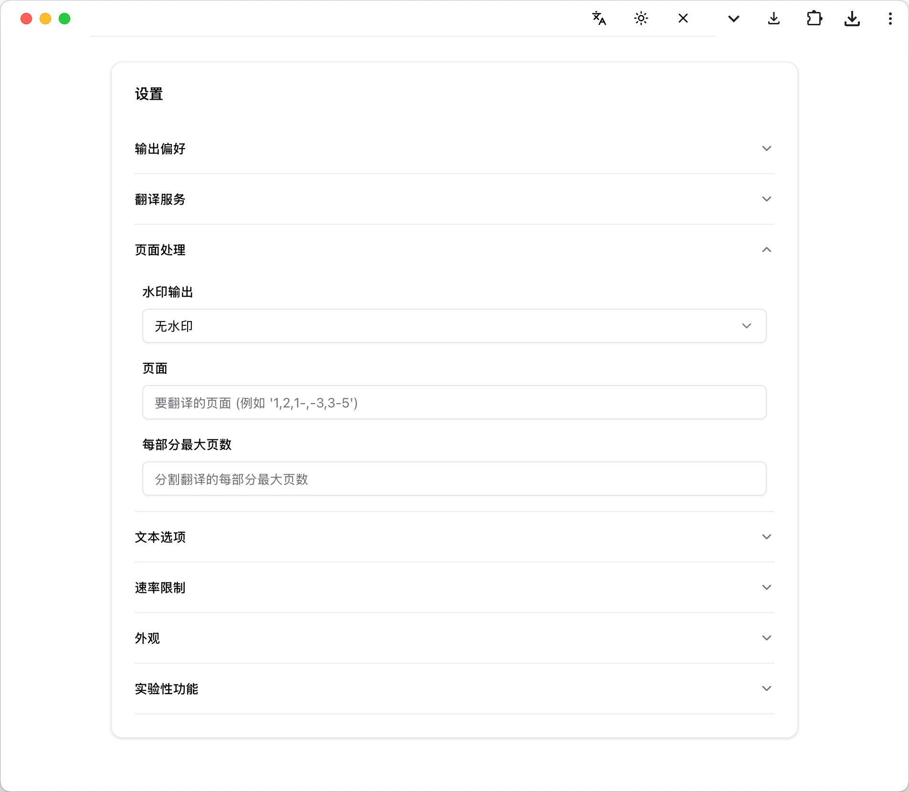
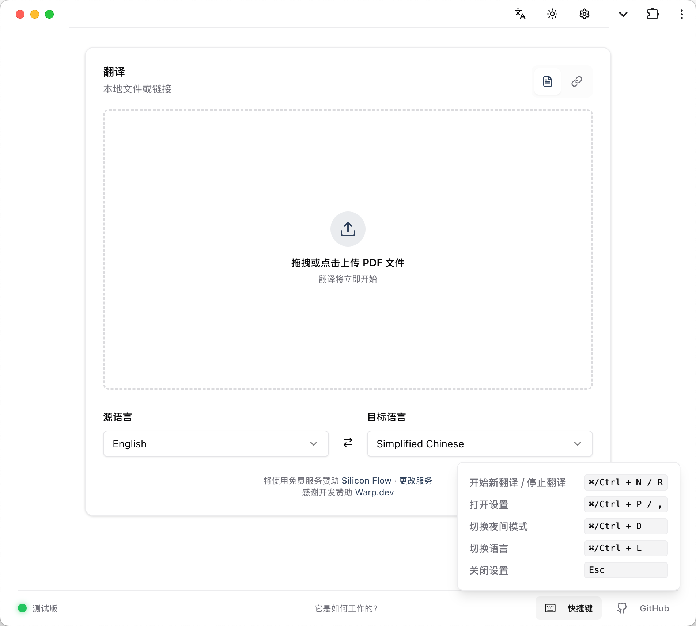

<div align="center">



<h2 id="title">Experimental GUI for PDFMathTranslate-next</h2>
</div>

### About this fork
In this fork, active developers are working on a Vue.js GUI for PDFMathTranslate-next, which brings a more firendly user experience, substantially improved quality, and much more features.

This fork, however, is still under development and is not stable. It is not recommended to use it for production.

### Main features
- **One-click translation** The new workflow is now designed to minimize the efforts in submitting a task. The users are afforded to start the translation using simply either a) dropping a file or b) selecting a file.

- **Dark mode and customizable colors** All functions have now been reorganized to simply user experience, with additional support for accent colors, dark modes, and the visualized preference of layouts.

    

- **Running as an application** The new interface can be installed as a standalone PWA application (like other native desktop applications) thus brings much better experience to the workflow that users may need.

- **Simplfied progress indicators** The present version visualized the progress of each stage of the translation thus making more sence for users.

    


- **Multilingual interface** Now we support for much more languages for the interfaces

    

- **Much more features from project `next`** Rich features from PDFMathTranslate-next have now been incorporated in GUI

    

- **Keyboard shortcuts** To improve the efficiency, every main operations in the main workflow have been assigned with common keyboard shorcuts. For example:
    - `Command + R` to start a new task
    - `Command + ,` to enter settings

    

More minor improvements:

- **Status detection** Now the status of the server running the application is more visible yet with simplicity to the users.

- **Elegant support for remote file** While remote files are less likely to be used, we provided a better UX experience for that.


- **Workload** We are now shoing the status and the workload of your computer to get a better sense of the procedure.


### How to build and install
```
sh ./gui.dev.sh
```

The first and second step will be removed after the development.